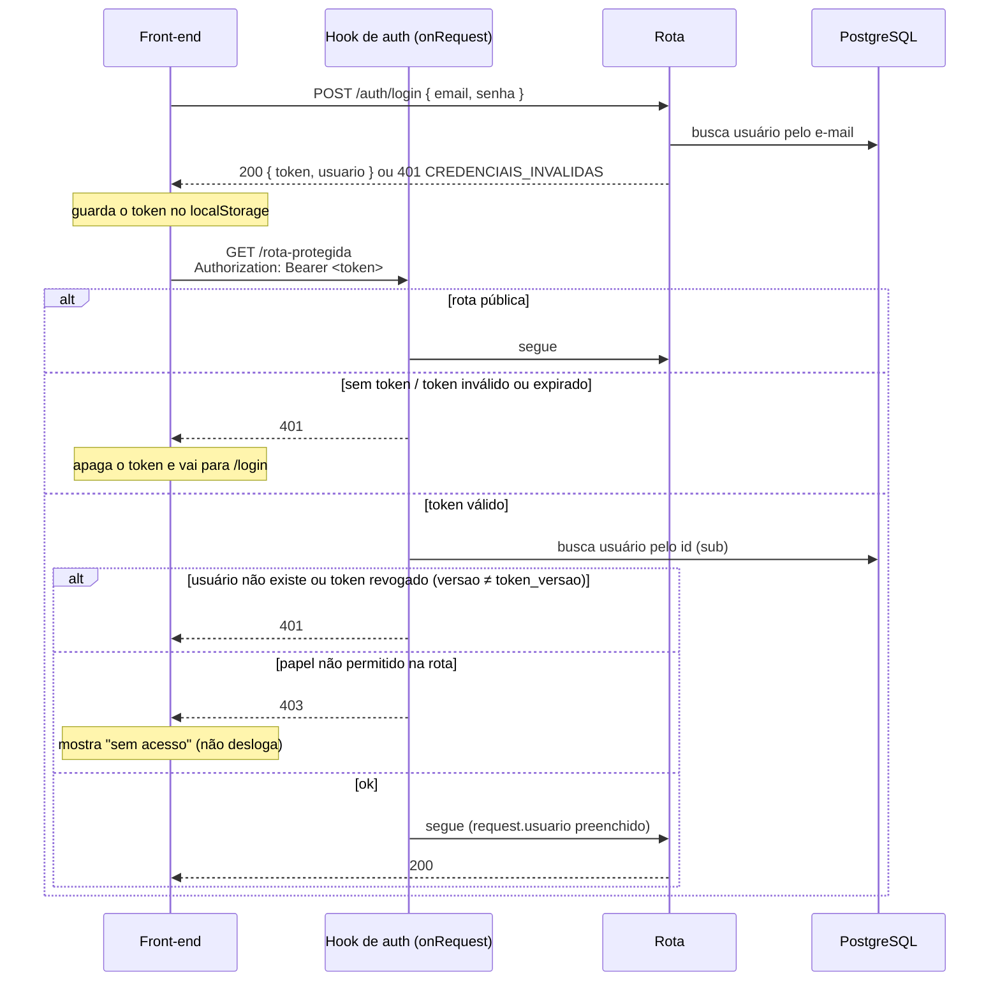

# Autenticação e autorização

Login por token (JWT) e controle de acesso por papel (`ADMIN` | `ALUNO`).

## Fluxo



## Token

- JWT assinado com `JWT_SECRET` (HS256), via `@fastify/jwt`.
- Payload: `{ sub: <id do usuário>, papel: "ADMIN" | "ALUNO", versao: <usuario.token_versao> }`.
- Validade: `JWT_EXPIRES_IN` (padrão `8h`). Não existe refresh token: quando o token expira, o usuário faz login de novo.

### Revogação (`token_versao`)

O token guarda a `versao` do usuário no momento do login. Quando `usuario.token_versao` é incrementado, todos os tokens emitidos antes deixam de valer, em **todos os dispositivos**.

Hoje isso acontece no **logout**. Se a troca ou a recuperação de senha entrar no futuro, a nova senha também deve incrementar a versão, derrubando as sessões antigas.

Isso não tem custo extra: o hook já consulta o usuário no banco a cada requisição, e só passa a comparar mais uma coluna.

### Armazenamento no front

O front guarda o token no `localStorage` e o envia em **toda** requisição:

```
Authorization: Bearer <token>
```

> Tradeoff aceito: um token no `localStorage` pode ser lido por um script injetado (XSS). Para reduzir o risco, o front não pode renderizar HTML vindo do usuário (`dangerouslySetInnerHTML`), e a API usa `@fastify/helmet`.

## Hook de autorização

Plugin `src/plugins/auth.ts`, registrado como hook `onRequest` global.

**Fechado por padrão:** toda rota exige token válido, a não ser que seja marcada como pública. Se alguém esquecer de configurar uma rota nova, ela fica protegida, e não aberta.

```ts
// pública
app.post("/auth/login", { config: { publica: true } }, handler);

// qualquer usuário autenticado
app.get("/auth/me", handler);

// só admin
app.get("/admin/alunos", { config: { papeis: ["ADMIN"] } }, handler);
```

A cada requisição, o hook:

1. Ignora rotas com `config.publica`.
2. Lê o header `Authorization`. Se estiver ausente → `401 TOKEN_AUSENTE`.
3. Valida a assinatura e a expiração. Se falhar → `401 TOKEN_INVALIDO`.
4. Busca o usuário no banco pelo `sub`. Se não existir, ou se a `versao` do token for diferente de `token_versao` (token revogado) → `401 TOKEN_INVALIDO`. Isso garante que o usuário ainda existe, que o token não foi revogado e que o papel usado é o atual do banco, e não o que estava no token.
5. Se a rota define `config.papeis` e o papel do usuário não está na lista → `403 SEM_PERMISSAO`.
6. Preenche `request.usuario` para a rota usar.

## Respostas de erro

Todos os erros da API seguem o mesmo formato:

```json
{
  "erro": {
    "codigo": "TOKEN_INVALIDO",
    "mensagem": "Sessão inválida ou expirada. Faça login novamente."
  }
}
```

`codigo` é estável e serve para o front decidir o que fazer. `mensagem` pode ser exibida ao usuário.

| Status | `codigo`                | Quando                                                               | Front-end                              |
| ------ | ----------------------- | -------------------------------------------------------------------- | -------------------------------------- |
| 401    | `CREDENCIAIS_INVALIDAS` | E-mail ou senha errados                                              | Mostra o erro na tela de login         |
| 401    | `TOKEN_AUSENTE`         | Rota protegida sem header `Authorization`                            | Apaga o token e redireciona a `/login` |
| 401    | `TOKEN_INVALIDO`        | Token adulterado, expirado, revogado (logout) ou usuário inexistente | Apaga o token e redireciona a `/login` |
| 403    | `SEM_PERMISSAO`         | Usuário autenticado sem o papel exigido pela rota                    | Tela "sem acesso" (**não** desloga)    |
| 429    | `MUITAS_TENTATIVAS`     | Rate limit do login excedido                                         | Pede para aguardar e tentar de novo    |
| 400    | `VALIDACAO`             | Corpo/parâmetros inválidos (lista em `detalhes`)                     | Mostra o erro no campo indicado        |
| 4xx    | `REQUISICAO_INVALIDA`   | Requisição malformada (ex.: JSON quebrado)                           | Mensagem genérica de erro              |
| 404    | `NAO_ENCONTRADO`        | Rota inexistente, ou recurso inexistente (ex.: dúvida apagada)       | Mostra a mensagem e recarrega a lista  |
| 409    | `ORDEM_DESATUALIZADA`   | Reordenar dúvidas com uma lista que não bate com a do banco          | Avisa e recarrega a lista              |
| 409    | `JA_EM_GRUPO`           | O aluno já tem grupo nesta Física ([grupos.md](grupos.md))           | Mostra o grupo dele                    |
| 500    | `ERRO_INTERNO`          | Erro inesperado (detalhes só no log do servidor)                     | Mensagem genérica de erro              |

Em `VALIDACAO`, `detalhes` traz `[{ "campo": "email", "mensagem": "..." }]`.

A mensagem de `CREDENCIAIS_INVALIDAS` é sempre genérica ("E-mail ou senha inválidos."). Ela não revela se o e-mail está cadastrado.

## Rotas

| Método | Rota           | Acesso      | Descrição                                                                                                       |
| ------ | -------------- | ----------- | --------------------------------------------------------------------------------------------------------------- |
| POST   | `/auth/login`  | Pública     | Recebe `{ email, senha }`, devolve `{ token, usuario }`                                                         |
| GET    | `/auth/me`     | Autenticado | Dados do usuário logado (o front usa ao recarregar a página)                                                    |
| POST   | `/auth/logout` | Autenticado | Incrementa `token_versao`: derruba as sessões do usuário em todos os dispositivos. O front também apaga o token |

`usuario` (também em `GET /auth/me`) é `{ id, email, nome, papel }`.

`POST /auth/login` tem rate limit (`@fastify/rate-limit`): **10 tentativas por minuto por IP + e-mail** (normalizado). A chave inclui o e-mail porque os alunos do Inatel acessam pela mesma rede, ou seja, pelo mesmo IP. Um limite só por IP bloquearia a turma inteira por causa das tentativas de um aluno.

Para o tempo de resposta não revelar se um e-mail está cadastrado, o e-mail inexistente também passa por uma verificação argon2, contra um hash falso.

## Login e senha

- O login de todos os usuários é o **e-mail** (`usuario.email`, único). Ele é normalizado (sem espaços nas pontas, em **minúsculas**) antes de gravar e antes de comparar: `Maria@Inatel.br` = `maria@inatel.br`.
- O corpo do login é validado como e-mail (até 254 caracteres); fora do formato, `400 VALIDACAO`.
- As senhas são guardadas com hash **argon2** (`argon2id`), nunca em texto.
- **Não existe troca nem recuperação de senha** nesta versão, e o sistema não envia e-mails.

### Aluno

- Login: o e-mail, que vem de uma **coluna da planilha** de upload.
- Senha: **curso + matrícula** (ex.: `GES589`), gerada por `senhaDoAluno({ curso, matricula })` (`back/src/modules/auth/service.ts`) quando o aluno é cadastrado no upload.
- A senha do aluno **não diferencia maiúsculas**: `ges589` = `GES589`. O hash é gravado em maiúsculas e, no login de um aluno, o que foi digitado é convertido antes de comparar. Isso evita erros por caps lock no celular.
- Como o aluno é reaproveitado entre edições, a senha continua a mesma de um semestre para o outro.

#### Risco aceito

A senha do aluno **não é secreta**: curso e matrícula são conhecidos pelos colegas, e o e-mail institucional costuma ser fácil de deduzir. Quem souber esses dados de um colega consegue entrar como ele, criar ou sair de grupos em seu nome, e o sistema registra como se tivesse sido o colega. O rate limit do login também não protege contra isso, porque não há o que adivinhar.

O próprio sistema amplia esse risco: nas telas de grupo, **o aluno vê o curso e a matrícula dos colegas** da mesma Física (como no Figma, ver [grupos.md](grupos.md)). Ou seja, qualquer aluno logado tem a senha dos colegas, e só precisa deduzir o e-mail deles. Também foi uma decisão consciente.

Foi uma decisão consciente para esta primeira versão (simplicidade, sem depender de um servidor de e-mail). Para fechar o risco, a evolução prevista é voltar a gerar uma **senha aleatória** e enviá-la por e-mail usando o **SMTP do Inatel**, se o coordenador aprovar ([roadmap](roadmap.md#futuro)).

### Admin

- Existe **um único** admin, criado pelo seed do Prisma a partir de `ADMIN_EMAIL` e `ADMIN_SENHA` (`.env`).
- A senha do admin **diferencia maiúsculas** (não passa pela normalização da senha do aluno).
- `ADMIN_SENHA` precisa ter **pelo menos 16 caracteres** (o seed recusa senhas menores). O admin é o alvo mais valioso: a senha dele é escolhida por uma pessoa, e o rate limit do login é por IP + e-mail, então não impede tentativas vindas de muitos IPs.
- O seed é idempotente: rodar de novo não duplica o admin.
- **O admin não troca a senha pelo sistema** (decisão desta primeira versão). A única forma é mudar `ADMIN_SENHA` no `.env` e rodar `npm run db:seed` de novo, o que atualiza o hash.
- Limitação conhecida: o seed **não** incrementa `token_versao`, então tokens do admin emitidos antes da troca continuam válidos até expirar (`JWT_EXPIRES_IN`). Se a troca de senha do admin entrar no sistema, ela deve incrementar `token_versao`.

## Swagger

- A documentação interativa da API fica em `/docs` (`@fastify/swagger` + `@fastify/swagger-ui`). Os schemas vêm dos mesmos schemas Zod que validam as rotas.
- Para testar rotas protegidas: chame `POST /auth/login`, copie o `token`, clique em **Authorize** e cole o token (sem o prefixo `Bearer`).
- Só fica ativa quando `SWAGGER_ENABLED=true`. Em produção, deixe `false`.

## Variáveis de ambiente

| Variável          | Descrição                                      |
| ----------------- | ---------------------------------------------- |
| `JWT_SECRET`      | Segredo de assinatura do token (mín. 32 chars) |
| `JWT_EXPIRES_IN`  | Validade do token (ex.: `8h`)                  |
| `ADMIN_EMAIL`     | E-mail (login) do admin criado pelo seed       |
| `ADMIN_SENHA`     | Senha do admin criado pelo seed (mín. 16)      |
| `SWAGGER_ENABLED` | Expõe `/docs` (`true` em dev, `false` em prod) |
