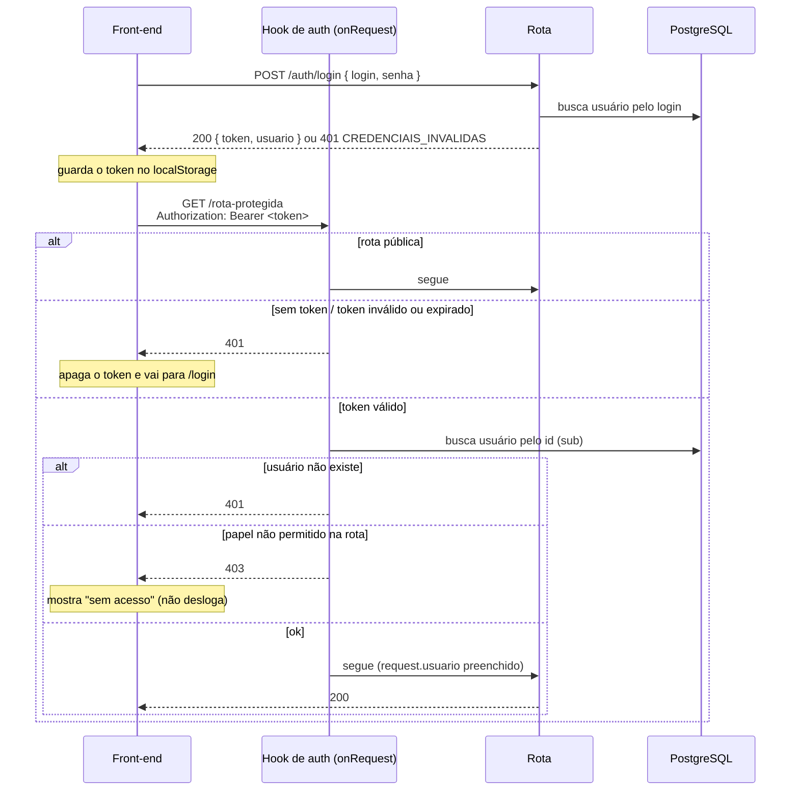

# Autenticação e autorização

Login por token (JWT) e controle de acesso por papel (`ADMIN` | `ALUNO`).

## Fluxo



## Token

- JWT assinado com `JWT_SECRET` (HS256), via `@fastify/jwt`.
- Payload: `{ sub: <id do usuário>, papel: "ADMIN" | "ALUNO" }`.
- Validade: `JWT_EXPIRES_IN` (padrão `8h`). Não existe refresh token: quando o token expira, o usuário faz login de novo.

### Armazenamento no front

O front guarda o token no `localStorage` e o envia em **toda** requisição:

```
Authorization: Bearer <token>
```

> Tradeoff aceito: um token no `localStorage` pode ser lido por um script injetado (XSS). Para reduzir o risco, o front não pode renderizar HTML vindo do usuário (`dangerouslySetInnerHTML`), e a API usa `@fastify/helmet`.

## Hook de autorização

Plugin `src/plugins/auth.ts`, registrado como hook `onRequest` global.

**Fechado por padrão:** toda rota exige token válido, a não ser que seja marcada como pública. Se alguém esquecer de configurar uma rota nova, ela fica protegida, e não aberta.

```ts
// pública
app.post('/auth/login', { config: { publica: true } }, handler)

// qualquer usuário autenticado
app.get('/auth/me', handler)

// só admin
app.get('/admin/alunos', { config: { papeis: ['ADMIN'] } }, handler)
```

A cada requisição, o hook:

1. Ignora rotas com `config.publica`.
2. Lê o header `Authorization`. Se estiver ausente → `401 TOKEN_AUSENTE`.
3. Valida a assinatura e a expiração. Se falhar → `401 TOKEN_INVALIDO`.
4. Busca o usuário no banco pelo `sub`. Se não existir → `401 TOKEN_INVALIDO`. Isso garante que o usuário ainda existe e que o papel usado é o atual do banco, e não o que estava no token.
5. Se a rota define `config.papeis` e o papel do usuário não está na lista → `403 SEM_PERMISSAO`.
6. Preenche `request.usuario` para a rota usar.

## Respostas de erro

Todos os erros da API seguem o mesmo formato:

```json
{ "erro": { "codigo": "TOKEN_INVALIDO", "mensagem": "Sessão expirada. Faça login novamente." } }
```

`codigo` é estável e serve para o front decidir o que fazer. `mensagem` pode ser exibida ao usuário.

| Status | `codigo`                | Quando                                             | Front-end                              |
| ------ | ----------------------- | -------------------------------------------------- | -------------------------------------- |
| 401    | `CREDENCIAIS_INVALIDAS` | Login ou senha errados                             | Mostra o erro na tela de login         |
| 401    | `TOKEN_AUSENTE`         | Rota protegida sem header `Authorization`          | Apaga o token e redireciona a `/login` |
| 401    | `TOKEN_INVALIDO`        | Token adulterado, expirado ou usuário inexistente  | Apaga o token e redireciona a `/login` |
| 403    | `SEM_PERMISSAO`         | Usuário autenticado sem o papel exigido pela rota  | Tela "sem acesso" (**não** desloga)    |
| 429    | `MUITAS_TENTATIVAS`     | Rate limit do login excedido                       | Pede para aguardar e tentar de novo    |

A mensagem de `CREDENCIAIS_INVALIDAS` é sempre genérica ("Login ou senha inválidos"). Ela não revela se o login existe.

## Rotas

| Método | Rota           | Acesso      | Descrição                                                         |
| ------ | -------------- | ----------- | ----------------------------------------------------------------- |
| POST   | `/auth/login`  | Pública     | Recebe `{ login, senha }`, devolve `{ token, usuario }`           |
| GET    | `/auth/me`     | Autenticado | Dados do usuário logado (o front usa ao recarregar a página)      |
| POST   | `/auth/logout` | Autenticado | Stateless: só confirma. Quem descarta o token é o front           |

`POST /auth/login` tem rate limit (`@fastify/rate-limit`) por IP.

## Login e senha

- O login é normalizado para **maiúsculas** antes de gravar e antes de comparar (`ges589` = `GES589`).
- As senhas são guardadas com hash **argon2** (`argon2id`), nunca em texto.
- Por enquanto **não há troca de senha**: não existe endpoint para isso.

### Aluno

- Login: `curso + matrícula` (ex.: `GES589`).
- Senha inicial: a própria matrícula.

> ⚠️ **Risco conhecido e aceito nesta versão:** quem souber o curso e a matrícula de um colega consegue entrar como ele. Mitigação atual: rate limit no login. Plano: gerar uma senha aleatória (letras, números e símbolos) e enviá-la por e-mail ao aluno. A coluna `usuario.deve_trocar_senha` já existe no modelo, reservada para esse fluxo, mas ainda não é aplicada pelo hook.

### Admin

- Existe **um único** admin, criado pelo seed do Prisma a partir de `ADMIN_LOGIN` e `ADMIN_SENHA` (`.env`).
- O seed é idempotente: rodar de novo não duplica o admin.

## Swagger

- A documentação interativa da API fica em `/docs` (`@fastify/swagger` + `@fastify/swagger-ui`). Os schemas vêm dos mesmos schemas Zod que validam as rotas.
- Para testar rotas protegidas: chame `POST /auth/login`, copie o `token`, clique em **Authorize** e cole o token (sem o prefixo `Bearer`).
- Só fica ativa quando `SWAGGER_ENABLED=true`. Em produção, deixe `false`.

## Variáveis de ambiente

| Variável          | Descrição                                       |
| ----------------- | ----------------------------------------------- |
| `JWT_SECRET`      | Segredo de assinatura do token (mín. 32 chars)  |
| `JWT_EXPIRES_IN`  | Validade do token (ex.: `8h`)                   |
| `ADMIN_LOGIN`     | Login do admin criado pelo seed                 |
| `ADMIN_SENHA`     | Senha do admin criado pelo seed                 |
| `SWAGGER_ENABLED` | Expõe `/docs` (`true` em dev, `false` em prod)  |
