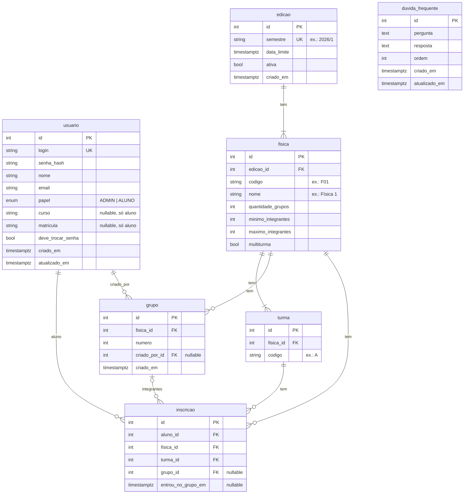

# Modelo do banco de dados

PostgreSQL, gerenciado via Prisma. Nomes de tabelas e colunas em português, `snake_case`.

## Diagrama

## Tabelas

### `usuario`

Admins e alunos numa única tabela, diferenciados por `papel`.

- `login` é único. Para alunos: `curso + matrícula` (ex.: `GES589`).
- `senha_hash`: nunca guardar a senha em texto. Senha inicial do aluno = matrícula.
- `deve_trocar_senha`: força a troca no primeiro acesso (prepara a futura senha personalizada enviada por e-mail).
- `UNIQUE(curso, matricula)`: o aluno é uma pessoa única, reaproveitada entre edições.

### `edicao`

- `semestre` único (ex.: `2026/1`).
- `data_limite`: prazo para formar grupos, vale para todas as Físicas da edição.
- `ativa`: só uma edição ativa por vez, garantido por índice único parcial (`... WHERE ativa = true`), criado via SQL na migration.

### `fisica`

Criada por edição, a partir das abas da planilha.

- `UNIQUE(edicao_id, codigo)`.
- `CHECK(minimo_integrantes <= maximo_integrantes)`.
- `multiturma`: se `true`, permite grupos com alunos de turmas diferentes da mesma Física.

### `turma`

Pertence a uma Física (ex.: turma `A` da F01 → "F01-A").

- `UNIQUE(fisica_id, codigo)`.
- `UNIQUE(id, fisica_id)`: alvo da FK composta de `inscricao`.

### `grupo`

Identificado pelo `numero` dentro da Física ("Grupo 2 — Física 1").

- `UNIQUE(fisica_id, numero)`.
- `UNIQUE(id, fisica_id)`: alvo da FK composta de `inscricao`.
- **Formado** não é coluna: é calculado (integrantes ≥ `minimo_integrantes` da Física).

### `inscricao`

O aluno numa Física: uma linha para cada aba da planilha em que ele aparece.

- `UNIQUE(aluno_id, fisica_id)`: uma turma por Física por aluno.
- `grupo_id` fica aqui, então o aluno tem no máximo um grupo por Física.
- FK composta `(turma_id, fisica_id) → turma(id, fisica_id)`: a turma é da mesma Física.
- FK composta `(grupo_id, fisica_id) → grupo(id, fisica_id)`: o grupo é da mesma Física. É `ON DELETE RESTRICT`, porque um `SET NULL` também anularia `fisica_id`, que é obrigatória. Para apagar um grupo, o service primeiro desvincula os integrantes (`grupo_id = NULL`) e depois apaga o grupo, na mesma transação.
- O vínculo aluno ↔ edição é derivado: `inscricao → fisica → edicao`.

### `duvida_frequente`

Global (sem vínculo com edição). `ordem` define a ordem de exibição.

## Regras validadas na aplicação

Validadas no back-end, dentro de uma transação com lock no grupo:

| Regra                                       | Quando                                             |
| ------------------------------------------- | -------------------------------------------------- |
| Integrantes ≤ `maximo_integrantes`          | Criar grupo / entrar / admin adicionar             |
| Grupos ≤ `quantidade_grupos` da Física      | Criar grupo                                        |
| Agora ≤ `data_limite`                       | Ações do aluno (o admin pode alterar após o prazo) |
| Multiturma desligado → todos da mesma turma | Criar grupo / entrar / admin adicionar             |

## Futuro (fora do escopo atual)

- Tabela de token para redefinição de senha / envio de senha por e-mail.
- Nome ou tema opcional em `grupo`.
